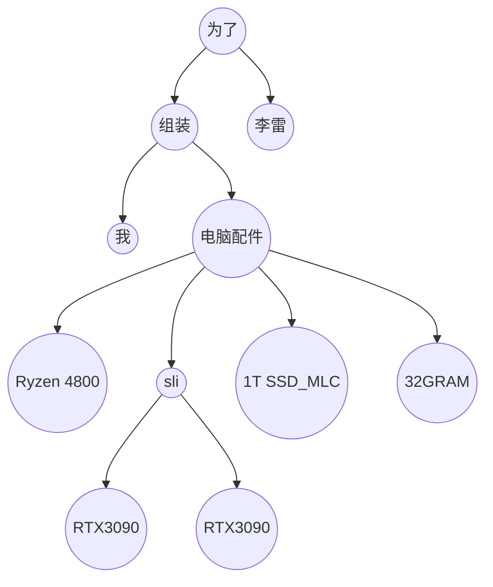
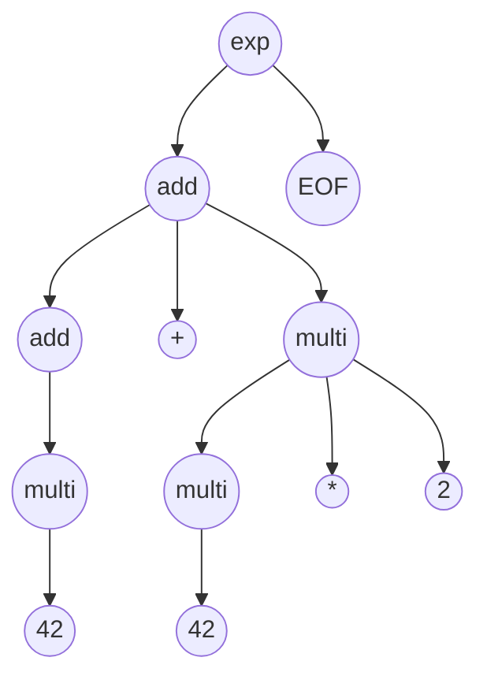

# Week 03

本周学习主题为使用LL算法构建四则运算的AST. 涉及了编译原理相关的知识,无奈本人非科班出身,并未系统性的学习过编译原理.在此仅能分享自己碎片化的见解.


## What's [AST](https://en.wikipedia.org/wiki/Abstract_syntax_tree)?

> Abstract syntax trees are [data structures](https://en.wikipedia.org/wiki/Data_structures) widely used in [compilers](https://en.wikipedia.org/wiki/Compilers) to represent the structure of program code. An AST is usually the result of the [syntax analysis](https://en.wikipedia.org/wiki/Syntax_analysis) phase of a compiler. It often serves as an intermediate representation of the program through several stages that the compiler requires, and has a strong impact on the final output of the compiler.
>
> *AST(Abstract syntax tree 抽象语法树)广泛用于编译器以展现代码解构。AST通常是编译器语法分析阶段的结果,A是编译过程的中间产物，对编译器的最终输出有很大影响。*

以上是wiki对于AST的定义和本人渣翻.

以自然语言做比喻,AST生产过程就是理解语言的含义,并进行关键字(token)的提取和重组.

```
我要帮李雷组装一台电脑配置是Ryzen 4800 + RTX3090 sli + 1T SSD(MLC) + 32GRAM
```


提取和重组

```
[我] [组装] [电脑(Ryzen 4800 + RTX3090 sli + 1T SSD_MLC + 32GRAM)] [为了] [李雷]
```


形成树




在前端领域`JS引擎`执行源代码,`Babel`、`Typescript`、`JSX`编译JS代码甚至`Sass` `Less`编译成css文件时都会产生`AST`. 

还有我们常见的`ESLint`的`unused variable`提示. `ESLint`就是通过`AST`知道了哪个是`variable`并且未使用过.


[astexplorer.net](https://astexplorer.net/)可以查看js代码生产的AST


## AST in 四则运算

本次课程中的四则远算AST实现逻辑如下:


AST生成逻辑如下:

1. scanner: 读取代码移除`空白符` `换行符号` `注释`等,然后把省下的分割成一个个`token`并标注类型(本课用的正则匹配),并将token组成一个数组(本课用的`tokenize`函数)
2. 语法分析: 将第一步得到的数组转为树形结构,同时还会校验语法如果有错会抛错(本课无错误处理)


如表达式`42 + 42 * 2`生产AST如下图




如下代码可以遍历AST输出计算结果(完整效果见index.html)

```js
function dfs(ast) {
  const { type, children, operator, value } = ast;

  if (children) {
    if (operator) {
      switch (operator) {
        case "+":
          return dfs(children[0]) + dfs(children[2]);
        case "-":
          return dfs(children[0]) - dfs(children[2]);
        case "*":
          return dfs(children[0]) * dfs(children[2]);
        case "/":
          return dfs(children[0]) / dfs(children[2]);
        default:
          break;
      }
    } else if (
      children.length === 1 ||
      (children.length === 2 && children[1].type === "EOF")
    ) {
      return dfs(children[0]);
    }
  } else {
    if (type === "Number") {
      return Number(value);
    }
  }
}
```


## 额外收获

正如`寒冬老师`在[重学前端](https://time.geekbang.org/column/intro/154?utm_campaign=guanwang&utm_source=baidu-ad&utm_medium=ppzq-pc&utm_content=title&utm_term=baidu-ad-ppzq-title)这门课中所讲.

> 我们专栏的目标是帮助你建立自己的知识体系，根据你自己的理解把前端的领域知识链接起来，形成结构，这样做，不但能帮助你记忆知识，还能在其中发现自己知识的缺失，甚至可以凭借知识体系来判断知识的重要性，来决定是否要深入学习。

~~上班摸鱼~~网上学习的时候常看到分号党之间的争吵.看到过下述说法,当时我便觉得不对,但是能力有限无法提出有效的反驳.

> 不加分号影响JS运行性能

学了本课之后,我们可以发现JS引擎生成的AST是不包含分号的,因此分号对于AST后续的性能是没有任何影响的,唯一可能的影响只在`源代码->AST`即parse阶段.但是一段代码只会parse一次.因此可以说分号是不会对JS运行性能产生影响.